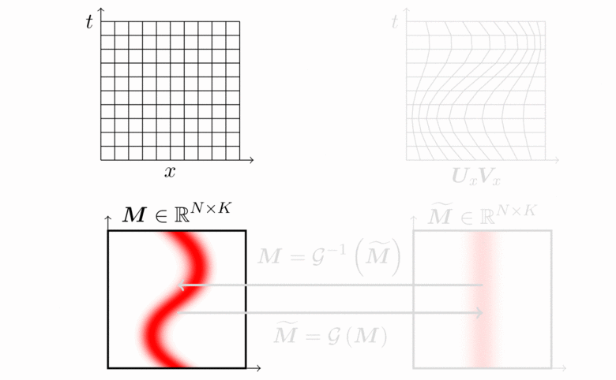
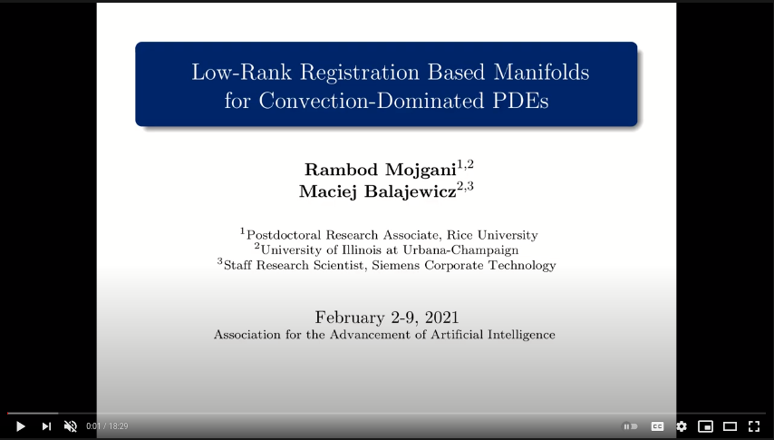

<!-- Latex generated by https://jsfiddle.net/8ndx694g/ -->

# [Physics-aware] low-rank registration based manifold[/auto-encoder] for convection dominated PDEs

#### [[project website]](https://arxiv.org/abs/2006.15655)


## Table of contents
* [Introduction](#introduction)
* [Method](#Method)
    * [Video-description](#Video-description)
* [FAQ](#FAQ)
* [Requirements](#Requirements)
* [Experiments](#Experiments)
    * [Rotating A](#Rotating-A)
    * [Two-dimensional fluid flows](#Two-dimensional-fluid-flows)
    * [Physics aware auto-encoder in an LSTM architecture](#Physics-aware-auto-encoder-in-an-LSTM-architecture)
* [Citation](#citation)

## Introduction
We design a physics-aware auto-encoder to specifically reduce the dimensionality of solutions arising from convection-dominated nonlinear physical systems. Although existing nonlinear manifold learning methods seem to be compelling tools to reduce the dimensionality of data characterized by a large Kolmogorov n-width, they typically lack a straightforward mapping from the latent space to the high-dimensional physical space. Moreover, the realized latent variables are often hard to interpret. Therefore, many of these methods are often dismissed in the reduced order modeling of dynamical systems governed by the partial differential equations (PDEs). Accordingly, we propose an auto-encoder type nonlinear dimensionality reduction algorithm. The unsupervised learning problem trains a diffeomorphic spatio-temporal grid, that registers the output sequence of the PDEs on a non-uniform parameter/time-varying grid, such that the Kolmogorov n-width of the mapped data on the learned grid is minimized. We demonstrate the efficacy and interpretability of our approach to separate convection/advection from diffusion/scaling on various manufactured and physical systems.

## Method

### Video-description 
- [Low-rank registeration based manifolds](https://youtu.be/fDYPAj9WAbk)\
<a href="https://youtu.be/fDYPAj9WAbk" title="AAAI-21"></a>


## FAQ

- **Why is the method considered *physics-aware*?**
	- The existance of a low-rank time/parameter-varying grid that minimizes the Kolmogrov n-width of the snapshots is a conjecture based on the physics of many of the convection dominated flows and is based on the possiblity of low-rank approximation of the characteristics line of hyperbolic PDEs, read sec 3.1 of [this](https://arxiv.org/abs/1701.04343).
	
- **Why is the method considered an *auto-encoder*?**
	- We make a one-to-one comparison of the traditional definition of a neural network-based auto-encoder to the proposed approach. An auto-encoder is defined as:
	<!-- \begin{array}{l}
		\phi: \mathcal{X} \rightarrow \mathcal{F} \\
		\psi: \mathcal{F} \rightarrow \mathcal{X} \\
		\phi, \psi=\underset{\phi, \psi}{\arg \min }\|X-(\psi \circ \phi) X\|^{2}.
		\end{array} -->
	
&nbsp;&nbsp;&nbsp;&nbsp;&nbsp;&nbsp;&nbsp;&nbsp;&nbsp;&nbsp;
	
&nbsp;&nbsp;&nbsp;&nbsp;&nbsp;&nbsp;&nbsp;&nbsp;&nbsp;&nbsp;It comprares to low-rank registeration based manifold defined as:
	<!-- \begin{array}{l}
		\mathcal{G}: {M} \rightarrow \widetilde{M} \\
		\mathcal{G}^{-1}: \widetilde{M} \rightarrow {M} \\
		\mathcal{G}, \mathcal{G}^{-1}=\underset{ \mathcal{G}, \mathcal{G}^{-1}}{\arg \min }\| M -\mathcal{G}^{-1} ( \mathcal{G} (M)) \|^{2}.
		\end{array} -->
		
&nbsp;&nbsp;&nbsp;&nbsp;&nbsp;&nbsp;&nbsp;&nbsp;&nbsp;&nbsp;

&nbsp;&nbsp;&nbsp;&nbsp;&nbsp;&nbsp;&nbsp;&nbsp;&nbsp;&nbsp;Our proposed low-rank registeration based method *acts* as an auto-encoder where the *encoder/decoders*, and , are the mapping *to/from* the time/parameter-varying grid,  and . The *code* is the interpolated data on the time/parameter-varying grid, here . The feature space, , is the space of time/parameter-varying grid, i.e. . The proposed feature space is *compressed* since it is of a lower dimensionality (here rank) compared to the the input space, , here  is of lower rank compared to .
	
- **How does the method handle noisy data?**
	- SVD (singular value decomposition) and truncation at the heart of the algorithm acts as a filter removing the low energy-containing features of the data, i.e. the noise is filtered as a result of SVD-truncate.

- **What interpolation scheme to use?**
	- Use any of the off-the-shelf interpolation schemes, e.g. linear, cubic, spline. High order interpolation schemes only becomes advantageous in higher rank of reconstruction, i.e. higher . This is due to the local aliasing of high wave-number bases (features) on the coarsened grid. Since we are often interested in a low-rank reconstruction, linear interpolation would be sufficient.

- **What optimization scheme to use?**
	- Use any of the methods that can handle nonlinear constraints.


- **What's the complexity of the optimization problem?**
	- Each iteration of the optimization problem is of ; However, the cost can be reduced by *down-sampling* both  and , and yet evaluating the cost function on the fine grid. The number of iterations required for convergence is problem dependent.

## Requirements
- Matlab R2016+
- python 3.6
	- [scipy](https://pypi.org/project/scipy/)
	- [numpy](https://pypi.org/project/numpy/)
- [TensorFlow 2](https://www.tensorflow.org/install)
- [Keras 2.3.1](https://pypi.org/project/Keras/)

## Experiments
### Rotating A
Rotating A [Rotated A Location](./Experiments/rotatedA) 

open matlab
```
matlab -nodisplay -nosplash
```

Run the manifold learning
```
run main_rotatingA.m
```

Evaluate the snapshots on the learned manifold
```
run post_process.m
```

### Two-dimensional fluid flows
2D Fluid Flows (2D Riemann) [2D Fluid Flows](./Experiments/2DRiemann) 

open matlab
```
matlab -nodisplay -nosplash
```

Run the manifold learning
```
run main_opt_config03.m
run main_opt_config12.m
```
Evaluate the snapshots on the learned manifold
```
main_solve_config03.m
main_solve_config12.m
```


### Physics aware auto-encoder in an LSTM architecture
LSTM architecture [LSTM architecture](./Experiments/LSTM) 
* The notebooks are Google colab ready, make sure to have .py, *.pkl, *.h5 files at the same directory of the notebooks (*.ipynb)

#### Burgers' equation [](./Experiments/LSTM/Burgers/main_manifold_burgers.ipynb)

Run the manifold learning and train the LSTM with Physics-aware registration based auto-encoder
```
main_manifold_burgers.ipynb
```

Run the manifold learning and train the LSTM with Neural Network based auto-encoder
```
main_eulerian_burgers.ipynb
```

#### Wave equation [](./Experiments/LSTM/Wave/main_manifold_wave_small.ipynb)

Run the manifold learning and train the LSTM with Physics-aware registration based auto-encoder
```
 main_eulerian_wave_small.ipynb
```

Run the manifold learning and train the LSTM with Neural Network based auto-encoder
```
main_manifold_wave_small.ipynb
```


## Citation
The low-rank registeration based auto-encoder/manifold [2] is built on the idea of low-rank Lagrangian bases first introduced in [1].
Entries are listed chronologically.

- \[1\] [Mojgani, R.](https://www.rmojgani.com) and [Balajewicz, M.](https://scholar.google.com/citations?user=FLg_n08AAAAJ),
[**Lagrangian basis method for dimensionality reduction of convection dominated nonlinear flows.**](https://arxiv.org/abs/1701.04343)
arXiv:1701.04343.
([Download](https://arxiv.org/pdf/1701.04343))<details><summary>BibTeX</summary><pre>
@article{Mojgani_arxiv_2017,
	author={Mojgani, Rambod and Balajewicz, Maciej},
	title={Lagrangian basis method for dimensionality reduction of convection dominated nonlinear flows},
	journal={arXiv preprint arXiv:1701.04343},
	archivePrefix="arXiv",
	eprint={1701.04343},
	year=2017,
}</pre></details>

- \[2\] [Mojgani, R.](https://www.rmojgani.com) and [Balajewicz, M.](https://scholar.google.com/citations?user=FLg_n08AAAAJ),
[**Low-Rank Registration Based Manifolds for Convection-Dominated PDEs.**](https://www.aaai.org/AAAI21Papers/AAAI-8654.MojganiR.pdf)
_in Proceedings of Association for the Advancement of Artificial Intelligence, Virtual Conference, February, 2021. Paper AIAA-2021-8654.
([Download](https://arxiv.org/pdf/1701.04343))<details><summary>BibTeX</summary><pre>
@article{Mojgani_AAAI_2021,
	author={Mojgani, Rambod and Balajewicz, Maciej},
	title={Low-Rank Registration Based Manifolds for Convection-Dominated {PDE}s},
	journal={Proceedings of the AAAI Conference on Artificial Intelligence},
	year=2021,
}</pre></details>

