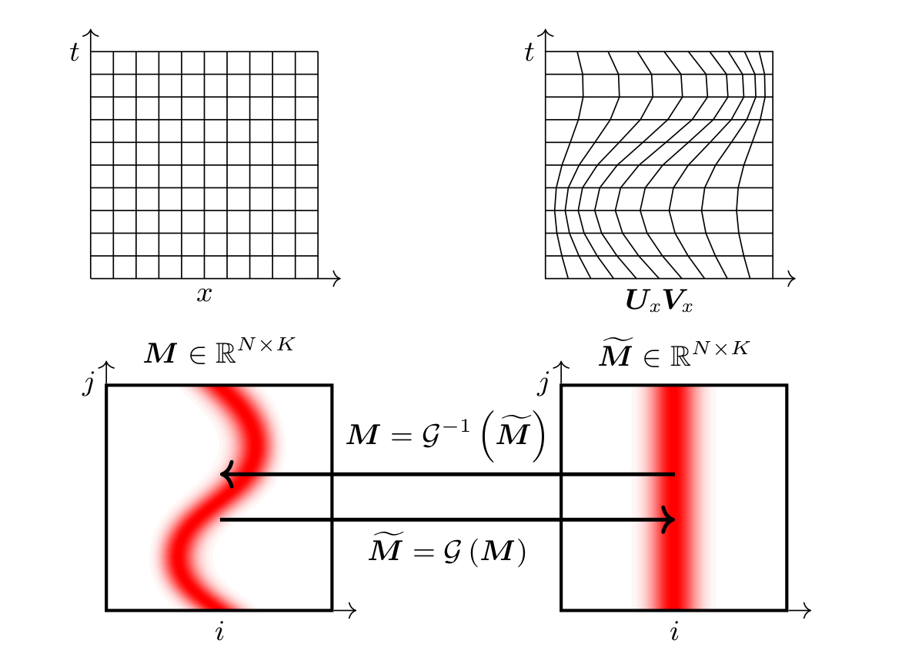

# Physics-aware registration based auto-encoder for convection dominated PDEs
#### [[project website]](http://www.tobe.updated)


**Requirements**
- Matlab R2016+
- python 3.6
	- [scipy](https://pypi.org/project/scipy/)
	- [numpy](https://pypi.org/project/numpy/)
- [TensorFlow 2](https://www.tensorflow.org/install)
- [Keras 2.3.1](https://pypi.org/project/Keras/)

## Experiments
### Rotating A
Rotating A [Rotated A Location](./Experiments/rotatedA) 

open matlab
```
matlab -nodisplay -nosplash
```

Run the manifold learning
```
run main_rotatingA.m
```

Evaluate the snapshots on the learned manifold
```
run post_process.m
```

### Two-dimensional fluid flows (2D Riemann Flows)
2D Fluid Flows [2D Fluid Flows](./Experiments/2DRiemann) 

open matlab
```
matlab -nodisplay -nosplash
```

Run the manifold learning
```
run main_opt_config03.m
run main_opt_config12.m
```
Evaluate the snapshots on the learned manifold
```
main_solve_config03.m
main_solve_config12.m
```


### Physics based auto-encoder in an LSTM architecture
LSTM architecture [LSTM architecture](./Experiments/LSTM) 
* The notebooks are Google colab ready, make sure to have .py, *.pkl, *.h5 files at the same directory of the notebooks (*.ipynb)

#### Burgers' equation [](./Experiments/LSTM/Burgers/main_manifold_burgers.ipynb)

Run the manifold learning and train the LSTM with Physics-aware registration based auto-encoder
```
main_manifold_burgers.ipynb
```

Run the manifold learning and train the LSTM with Neural Network based auto-encoder
```
main_eulerian_burgers.ipynb
```

#### Wave equation [](./Experiments/LSTM/Wave/main_manifold_wave_small.ipynb)

Run the manifold learning and train the LSTM with Physics-aware registration based auto-encoder
```
 main_eulerian_wave_small.ipynb
```

Run the manifold learning and train the LSTM with Neural Network based auto-encoder
```
main_manifold_wave_small.ipynb
```


